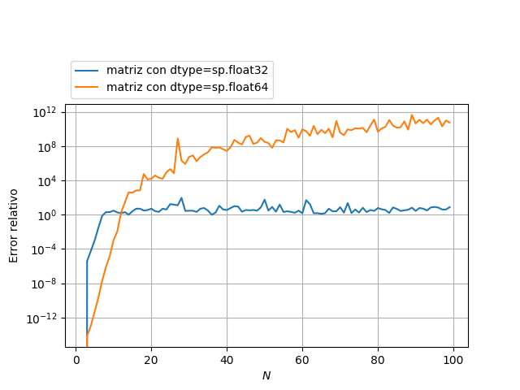

# MCOC-Proyecto-0
MCOC-Proyecto-0

Introducción
==============

La perdida de significancia es un efecto que se produce al trabajar con números decimales, exigiendo precisión absoluta. Debido a la
representación interna de los sistemas operativos de un número (básicamente, se busca la división entera que produzca el número pedido)
se pierden digitos de significancia que pueden generar errores inaceptables, especialmente en problemas mal condicionados. El mal condicionamiento 
de algo es; a grandes rasgos, que la variación en el output de un problema sea considerablemente mayor que el input; por lo que toma gran importancia
en métodos numéricos.

Este ejemplo
==============

La matriz de Hillbert se define cómo:

https://en.wikipedia.org/wiki/Hilbert_matrix
  

donde los indices i,j van desde 0 hasta n. Esta matriz es específicamente mal condicionada para valores de n suficientemente grandes,
por lo que estudiaremos el error que posee al crearla, invertirla y multiplicarla por si misma, obteniendo así una supuesta matriz identidad, para las cuales compararemos el mayor error
con respecto a la diagonal (términos no nulos). Esto se hará tanto con tipo de datos sp.float32 como sp.float64. Para calcular el error, se tomará el error relativo máximo entre mismas posiciones de la diagonal.

Resultados
==============

Se define el error relativo como 

	ERROR = (Promedio_Calculado - Resultado_Exacto) / Resultado_Exacto

Abajo se puede notar como para valores de n relativamente pequeños, el error generado por tipos de datos 32 es mayor que los de 64. Lo curioso, es que para valores de n más grandes, ésta relación se invierte
y las matrices con datos de 32 generan menor error que los de 64. 

Probablemente esto se debe a que matrices de esos tamaños están tan mal condicionados, que el error generado por la perdida de significancia en 
los datos genera un atenuamiento del mal condicionamiento de la matriz, resultando en un valor menos alejado de lo esperado. Faltaría comparar con otros tipos de datos de mayor y menos tamaño, y comprobar si la 
tendencia se repite.

Anexos
==============

+ Articulo wiki sobre el tema: [https://en.wikipedia.org/wiki/Loss_of_significance]
+ Articulo wiki sobre las matrices de Hillbert: [https://en.wikipedia.org/wiki/Hilbert_matrix]
